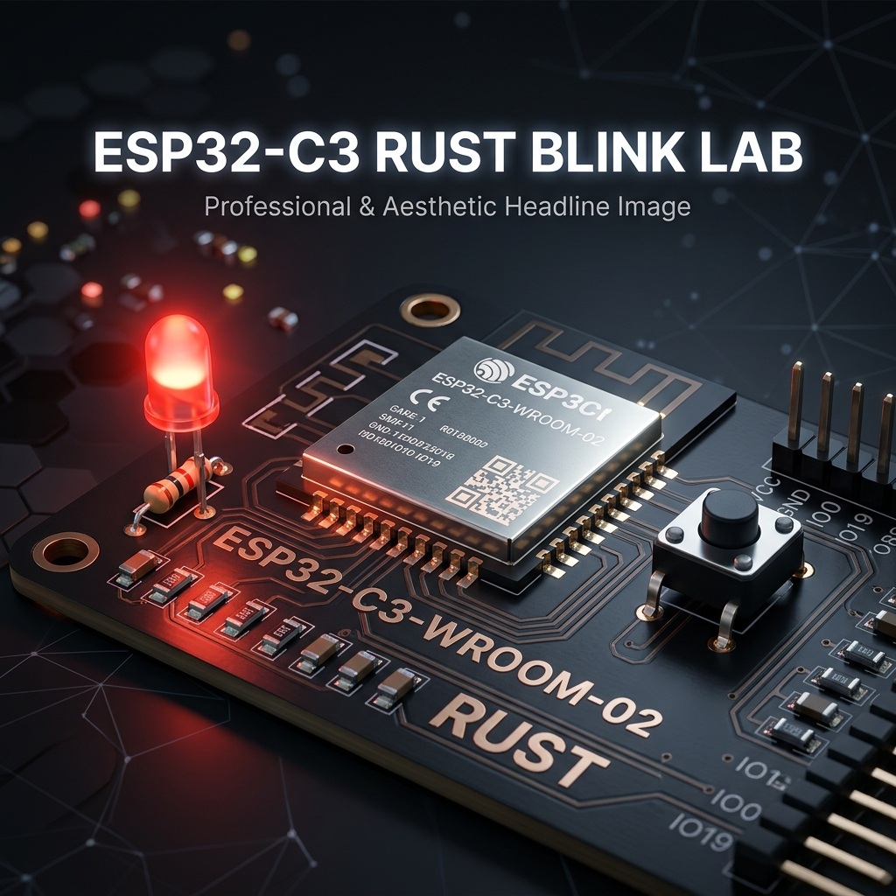

# ESP32-C3 Rust Blink Lab 🚀

[](https://www.rust-lang.org/)
[](https://www.espressif.com/en/products/socs/esp32-c3)



A comprehensive comparison and implementation of LED blinking on the ESP32-C3 using both **Standard Library (std)** and **Bare-Metal (no_std)** Rust.

## 🌟 Overview

This repository demonstrates two different approaches to embedded Rust development on the ESP32-C3 (RISC-V) platform. It includes:
1.  **`std-blink`**: Uses the `esp-idf-hal` and the standard library, providing a high-level, OS-like development experience.
2.  **`nostd-blink`**: A bare-metal implementation using `esp-hal`, optimized for minimal binary size and full hardware control.

## 📊 Comparison: `no_std` vs `std`

| Feature | `no_std` (Bare-Metal) | `std` (ESP-IDF) |
| :--- | :--- | :--- |
| **Abstraction Level** | Low (Direct register/peripherals) | High (OS-like features) |
| **Binary Size** | Minimal (optimized for flash) | Larger (includes RTOS/standard library) |
| **Ease of Use** | Higher learning curve | Easier for Rust/C++ developers |
| **Control** | Full control over every cycle | More overhead due to RTOS |
| **Best For** | Power-sensitive, small tasks | Complex apps (Wi-Fi, Bluetooth) |

> "The `no_std` version provides full control and tiny binaries, while the `std` version offers rapid prototyping and familiar APIs. Choose `no_std` for production efficiency and `std` for feature-rich applications."

## 🛠️ Getting Started

### Prerequisites

- [Rust](https://www.rust-lang.org/tools/install) (Nightly recommended for embedded)
- [esp-idf-sys](https://github.com/esp-rs/esp-idf-sys) dependencies (for `std`)
- [Wokwi](https://wokwi.com) for simulation

### Building & Running

#### Bare-Metal (`no_std`)
```bash
cd nostd-blink
cargo build --release
```

#### Standard Library (`std`)
```bash
cd std-blink
cargo build --release
```

### Simulation

Both projects are configured for [Wokwi](https://wokwi.com). You can use the [Wokwi VS Code extension](https://marketplace.visualstudio.com/items?itemName=Wokwi.wokwi-vscode) to run the simulations directly.

## 📜 License

This project is open-source and available under the [MIT License](LICENSE).
